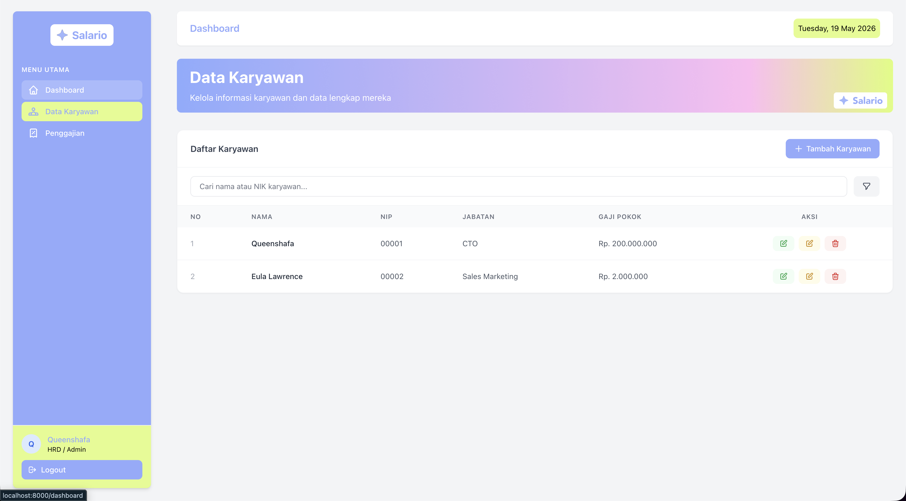

# Salario


Salario is a web-based payroll management platform built with Laravel and Tailwind CSS. It simplifies employee data input, net salary, calculations, and generates digital payslips within a modern, clean and functional interface.

Submitted to [Macondo!](https://macondo.hackclub.com/)

## Features

-   Authentification & Authorization
-   Employee Management
-   Payroll Management
-   Generate downloadable PDF payslips
-   Multi-tenant Data Isolation (Each user manage their own company data)
-   Responsive Dashboard

## Screenshots



## Cool, but how do I use Salario?

Salario is designed to be simple and easy to use.

1. Register an account and log in as the company's Admin/HRD.
2. Add employees from the Employee Data page.
3. Fill in employee information such as name, ID, position, and salary.
4. Manage allowances and deductions through the payroll section.
5. Generate and download employee payslips in PDF format.
6. Monitor company statistics from the dashboard.

## Tech Stack

#### Backend

-   Laravel 13
-   PHP 8.4

#### Frontend

-   Blade Template Engine
-   Tailwind CSS
-   JavaScript

#### Database

-   MySQL

#### Authentification

-   Laravel Breeze

#### Additional Package

-   [barryvdh/laravel-dompdf](https://github.com/barryvdh/laravel-dompdf)

#### Build Tool

-   Vite

## Run Locally

Make sure you have installed:

-   PHP 8.4+
-   Composer
-   Node.js & npm
-   MySQL

### 1. Clone Repository

```bash
git clone https://github.com/queenshafa/payroll-service
cd payroll-service
```

### 2. Install Dependencies

```bash
composer install
npm install
```

### 3. Configure Environment

```bash
cp .env.example .env
php artisan key:generate
```

### 4. Configure Database

Edit your `.env` file:

```env
DB_CONNECTION=mysql
DB_HOST=127.0.0.1
DB_PORT=3306
DB_DATABASE=payroll_service
DB_USERNAME=root
DB_PASSWORD=
```

### 5. Run Migrations

```bash
php artisan migrate
```

### 6. Build Assets

Development:

```bash
npm run dev
```

Production:

```bash
npm run build
```

### 7. Run Application

```bash
php artisan serve
```

Visit:

```text
http://127.0.0.1:8000
```

## Authentification

This project uses **Laravel Breeze** for:

-   User Registration
-   User Login & Logout
-   Session Authentification
-   Route Protection (Middleware)

## Default Account

Create a new account through the registration page and start managing your company's employees and payroll data.

## Author

-   Made with ❤️ by [@queenshafa](https://www.github.com/queenshafa)

## License

This project is licensed under the MIT License. See the [LICENSE](LICENSE) file for details.
